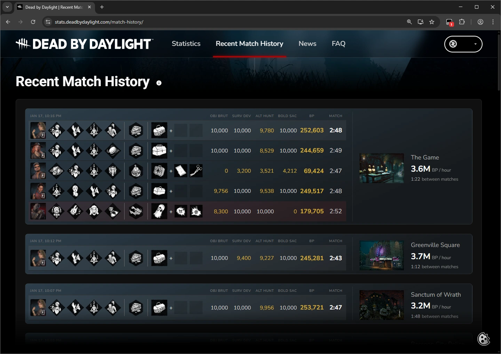

# DBD Detailed Match History

**Match history for BP/hour min-maxers.**

  

## Overview

This userscript makes the [DBD Match History](https://stats.deadbydaylight.com/match-history/) more useful for anyone interested in BP/hour.

- Score Category breakdown (Objectives, Survival, etc.)
- Time between matches (queue, lobby, tally screen)
- BP/hour, timed match-to-match
- Highlights any category < 10K
- Click to Expand/Collapse

## Install

1. Install a userscript manager
2. Install the userscript [directly](https://github.com/Bloodpoint-Farming/dbd-detailed-match-history/raw/refs/heads/main/dbd-detailed-match-history.user.js) or from [Greasy Fork](https://greasyfork.org/en/scripts/562996-dbd-detailed-match-history).

## Screenshot

